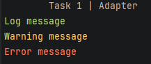
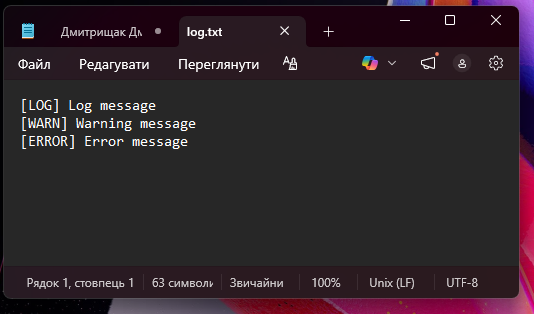
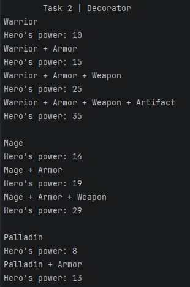
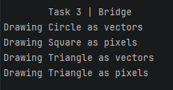
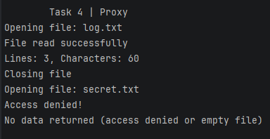
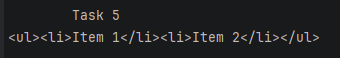

# Laboratory Work №3

---

## Task 1: Adapter

### Description
In this task I created a `Logger` that prints messages in different colors and a `FileWriter` that writes text into a file.

I used the Adapter pattern because it allows me to reuse existing classes and make them work together even if their interfaces are different.

---

## Task 2: Decorator

### Description
I created several hero classes (`Warrior`, `Mage`, `Paladin`) and added the ability to equip them with items like armor, weapons, and artifacts.

### Solution
I used:
- `Hero` interface  
- base hero classes  
- `HeroDecorator`  
- concrete decorators (`Armor`, `Weapon`, `Artifact`)  

I used the Decorator pattern so I could add new abilities to heroes dynamically without changing their original code.

---

## Task 3: Bridge

### Description
I created shapes (`Circle`, `Square`, `Triangle`) and made it possible to render them in different ways.

I separated shapes from rendering logic using `Renderer`.

The Bridge pattern helps to separate abstraction from implementation, so I can easily add new shapes or rendering types independently.

---

## Task 4: Proxy

### Description
I implemented a text reader and added extra functionality using proxies.

### Solution
I created:
- `SmartTextReader` (real object)  
- `SmartTextChecker` (logging proxy)  
- `SmartTextReaderLocker` (access control proxy)  

I connected them in a chain so each layer adds its own behavior.

The Proxy pattern lets me control access to the object and add functionality like logging and security without changing the original class.

### Result
- If the file is restricted → I output "Access denied!"  
- Otherwise → the file is read and logged  

---

## Task 5: Composite

### Description
I created my own simple HTML system called LightHTML.

### Solution
I implemented:
- `LightNode` (base class)  
- `LightTextNode` (text element)  
- `LightElementNode` (container element)  

I used the Composite pattern so I could treat single elements and groups of elements the same way and build a tree structure like real HTML.

 
